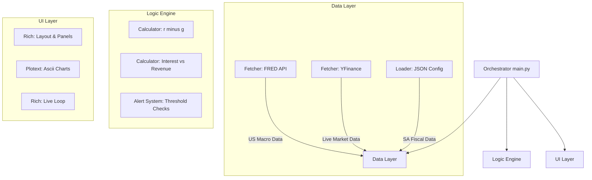

This document serves as the **Technical Specification** for "Project Sentinel." It is written to be handed directly to a junior engineer for implementation.

-----

# Technical Specification: Project Sentinel

**Version:** 1.0
**Type:** CLI Financial Dashboard
**Target System:** Local Terminal (Python)

## 1\. Project Overview

Project Sentinel is a real-time command-line dashboard designed to monitor **Sovereign Debt Risk** for the United States and South Africa. It visualizes the "Fiscal Dominance" thesis by tracking debt service costs relative to government revenue and economic growth.

**The "Why":** We need to detect when a country enters a "Doom Loop"—defined mathematically as when Interest Rates ($r$) exceed Growth Rates ($g$) and Interest Expense exceeds 20% of Tax Revenue.

## 2\. System Architecture

The application follows a **Modular Monolith** pattern. It separates data fetching (IO-bound) from business logic (CPU-bound) and presentation (UI).



### Directory Structure

Enforce this structure to keep the codebase clean.

```text
project_sentinel/
├── .env                  # API Keys (FRED_API_KEY=...)
├── config.py             # Constants (Thresholds, File Paths)
├── main.py               # Entry point (Run Loop)
├── data/
│   └── sa_fiscal.json    # Manual input file for SA Budget data
├── modules/
│   ├── __init__.py
│   ├── data_loader.py    # Handles FRED, YFinance, and JSON loading
│   ├── logic.py          # Pure functions for financial math
│   ├── render_chart.py   # Plotext charting functions
│   └── ui_layout.py      # Rich panels and table composition
└── requirements.txt      # Dependencies
```

## 3\. Tech Stack & Dependencies

  * **Runtime:** Python 3.10+
  * **Core Libraries:**
      * `rich`: For the dashboard UI (Tables, Panels, Layouts).
      * `plotext`: For rendering time-series charts inside the terminal.
      * `pandas`: For data manipulation and time-series alignment.
      * `fredapi`: To fetch US economic data (Official Fed API).
      * `yfinance`: To fetch live bond yields and currency pairs.
      * `python-dotenv`: To manage security (API Keys).

## 4\. Data Ingestion Strategy

We use a **Hybrid Data Model**: Automated API calls for the US, and a "Live Market + Manual Fiscal" mix for South Africa.

### A. United States (Automated)

  * **Source:** FRED API (Federal Reserve Bank of St. Louis)
  * **Endpoints (Series IDs):**
      * `GFDEBTN`: Federal Debt: Total Public Debt (Quarterly)
      * `A091RC1Q027SBEA`: Federal Government Current Expenditures: Interest Payments (Quarterly)
      * `W006RC1Q027SBEA`: Federal Government Current Tax Receipts (Quarterly)
      * `GDP`: Gross Domestic Product (Quarterly)
  * **Source:** YFinance
      * `^TNX`: 10-Year Treasury Yield (Live)

### B. South Africa (Hybrid)

  * **Source:** YFinance (Live)
      * `ZAR=X`: USD/ZAR Exchange Rate
  * **Source:** Manual JSON (`data/sa_fiscal.json`)
      * *Reason:* SA fiscal data APIs are unreliable/lagged. We will manually update this file twice a year (Feb Budget & Oct MTBPS).
      * **JSON Schema:**
    ```json
    {
      "last_updated": "2024-10-30",
      "debt_zar_billions": 5200.0,
      "annual_revenue_zar_billions": 1850.0,
      "annual_interest_expense_zar_billions": 380.0,
      "gdp_growth_forecast_pct": 1.1,
      "bond_yield_10y_static": 11.5
    }
    ```

## 5\. Core Logic Algorithms

The `logic.py` module must implement these specific formulas.

**1. The Doom Loop Ratio (Interest Burden)**
$$Ratio = \frac{\text{Annual Interest Expense}}{\text{Annual Tax Revenue}}$$

  * *Threshold:* If $> 0.20$ (20%), return `CRITICAL_WARNING`.

**2. The Growth Spread ($r - g$)**
$$Spread = \text{10Y Bond Yield} (r) - \text{GDP Growth Rate} (g)$$

  * *Logic:*
      * If $Spread < 0$: **Safe** (Growth is outpacing debt cost).
      * If $Spread > 0$: **Danger** (Debt is compounding faster than income).

## 6\. UI/UX Specification

The dashboard utilizes `rich.layout` to split the terminal into a grid.

**Layout Wireframe:**

```text
+---------------------------------------------------------------+
|  HEADER: [Blinking Dot] PROJECT SENTINEL - LIVE MONITOR       |
+------------------------------+--------------------------------+
|  USA PANEL (The Empire)      |  SA PANEL (Emerging Mkt)       |
|                              |                                |
|  Debt/GDP:      123% [RED]   |  USD/ZAR:      18.45 [YEL]     |
|  Interest/Rev:  18%  [YEL]   |  Interest/Rev: 22%   [RED]     |
|  10Y Yield:     4.5%         |  10Y Yield:    11.5%           |
|                              |                                |
|  [ PLOTEXT CHART AREA ]      |  [ PLOTEXT CHART AREA ]        |
|  (US 10Y Trend - 6 Months)   |  (USD/ZAR Trend - 6 Months)    |
|                              |                                |
+------------------------------+--------------------------------+
|  STATUS BAR:  Checking for Fiscal Dominance...  [OK]          |
+---------------------------------------------------------------+
```

## 7\. Implementation Steps (For the Junior Engineer)

### Phase 1: Data Harness (No UI)

  * **Task:** Create `modules/data_loader.py`.
  * **Goal:** Write two functions: `get_us_metrics()` and `get_sa_metrics()`.
  * **Verification:** Create a temporary `test.py` that prints the raw Dictionary of data to the console. Ensure FRED API key works.

### Phase 2: The Chart Engine

  * **Task:** Create `modules/render_chart.py`.
  * **Goal:** Write a function `build_sparkline(ticker_symbol)` that fetches 6 months of history via `yfinance`, passes it to `plotext`, and returns the chart as a **string**.
  * **Note:** Remember to use `plt.build()` and `plt.clf()` to clear the buffer, otherwise charts will overlay on top of each other.

### Phase 3: The Dashboard Assembly

  * **Task:** Create `modules/ui_layout.py` and `main.py`.
  * **Goal:** Use `rich.Live` to refresh the screen every 60 seconds.
  * **Logic:**
    1.  Fetch Data (Phase 1).
    2.  Generate Charts (Phase 2).
    3.  Pass both to the Layout.
    4.  Sleep for 60s.

### Phase 4: The Alert Logic

  * **Task:** Implement the conditional formatting.
  * **Goal:**
      * If US Interest/Rev \> 18%: Change Panel Border to **Red**.
      * If USD/ZAR \> 19.00: Flash the text.

## 8\. Immediate Action Items

1.  **Get API Key:** Register for a free API key at [fred.stlouisfed.org](https://fred.stlouisfed.org/docs/api/api_key.html).
2.  **Environment:**
    ```bash
    mkdir project_sentinel
    cd project_sentinel
    python -m venv venv
    source venv/bin/activate  # or venv\Scripts\activate on Windows
    pip install rich plotext yfinance fredapi pandas python-dotenv
    ```
3.  **Start Coding:** Begin with Phase 1.