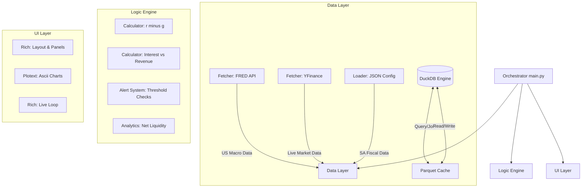

This document serves as the **Technical Specification** for "Project Sentinel." It is written to be handed directly to a junior engineer for implementation.

-----

# Technical Specification: Project Sentinel

**Version:** 2.0 (DuckDB Migration)
**Type:** CLI Financial Dashboard
**Target System:** Local Terminal (Python)

## 1. Project Overview

Project Sentinel is a real-time command-line dashboard designed to monitor **Sovereign Debt Risk** for the United States and South Africa. It visualizes the "Fiscal Dominance" thesis by tracking debt service costs relative to government revenue and economic growth.

**The "Why":** We need to detect when a country enters a "Doom Loop"—defined mathematically as when Interest Rates ($r$) exceed Growth Rates ($g$) and Interest Expense exceeds 20% of Tax Revenue.

## 2. System Architecture

The application follows a **Modular Monolith** pattern. It separates data fetching (IO-bound) from business logic (CPU-bound) and presentation (UI).



### Directory Structure

Enforce this structure to keep the codebase clean.

```text
project_sentinel/
├── .env                  # API Keys (FRED_API_KEY=...)
├── config.py             # Constants (Thresholds, File Paths)
├── main.py               # Entry point (Run Loop)
├── data/
│   ├── cache/            # Parquet files for time-series data
│   └── sa_fiscal.json    # Manual input file for SA Budget data
├── modules/
│   ├── __init__.py
│   ├── data_loader.py    # Handles FRED, YFinance, and JSON loading
│   ├── db_manager.py     # DuckDB and Parquet interactions
│   ├── logic.py          # Pure functions for financial math
│   ├── render_chart.py   # Plotext charting functions
│   └── ui_layout.py      # Rich panels and table composition
└── requirements.txt      # Dependencies
```

## 3. Tech Stack & Dependencies

  * **Runtime:** Python 3.10+
  * **Core Libraries:**
      * `rich`: For the dashboard UI (Tables, Panels, Layouts).
      * `plotext`: For rendering time-series charts inside the terminal.
      * `pandas`: For data manipulation and time-series alignment.
      * `duckdb`: High-performance analytical database engine.
      * `pyarrow`: For Parquet file handling.
      * `fredapi`: To fetch US economic data (Official Fed API).
      * `yfinance`: To fetch live bond yields and currency pairs.
      * `python-dotenv`: To manage security (API Keys).

## 4. Data Ingestion Strategy

We use a **Hybrid Data Model**: Automated API calls for the US, and a "Live Market + Manual Fiscal" mix for South Africa, all backed by a **DuckDB + Parquet Cache**.

### Caching Layer (`sentinel.duckdb` + `data/cache/*.parquet`)

To ensure resilience and speed, all network requests are cached.

**Storage Strategy:**
1.  **Metrics (Single Value):** Stored in DuckDB `metric_cache` table.
2.  **Time Series (Charts):** Stored as **Parquet** files in `data/cache/`. DuckDB queries these directly for complex analytics.

**DuckDB Schema:**
```sql
CREATE TABLE IF NOT EXISTS metric_cache (
    key VARCHAR PRIMARY KEY,    -- e.g., "US_GDP", "US_10Y"
    value DOUBLE,               -- The numeric value
    timestamp TIMESTAMP,        -- When it was fetched
    source VARCHAR              -- "FRED", "YFINANCE"
);

CREATE TABLE IF NOT EXISTS chart_metadata (
    ticker VARCHAR PRIMARY KEY, -- e.g., "^TNX"
    timestamp TIMESTAMP         -- Last fetch time
);
```

**Strategy:**
1.  **Check Cache:** Is data present and fresh (< 24h for Macro, < 15m for Market)?
2.  **Hit:** Return cached value (read Parquet if chart).
3.  **Miss:** Call API $\rightarrow$ Save to Parquet/DB $\rightarrow$ Return value.
4.  **Error:** Return last known cached value (if any) with `is_stale=True`.

### A. United States (Automated)
  * **Source:** FRED API (Federal Reserve Bank of St. Louis)
      * `GFDEBTN`: Federal Debt
      * `A091RC1Q027SBEA`: Interest Payments
      * `W006RC1Q027SBEA`: Tax Receipts
      * `GDP`: Gross Domestic Product
      * `WALCL`: Fed Total Assets (Net Liquidity)
      * `WTREGEN`: Treasury General Account (Net Liquidity)
      * `RRPONTSYD`: Reverse Repo (Net Liquidity)
  * **Source:** YFinance
      * `^TNX`: 10-Year Treasury Yield
      * `^IRX`: 3-Month Treasury Yield
      * `^GSPC`: S&P 500

### B. South Africa (Hybrid)
  * **Source:** YFinance (`ZAR=X`)
  * **Source:** Manual JSON (`data/sa_fiscal.json`)

## 5. Core Logic Algorithms

The `logic.py` module must implement these specific formulas.

**1. The Doom Loop Ratio (Interest Burden)**
$$Ratio = \frac{\text{Annual Interest Expense}}{\text{Annual Tax Revenue}}$$
  * *Threshold:* If $> 0.20$ (20%), return `CRITICAL_WARNING`.

**2. The Growth Spread ($r - g$)**
$$Spread = \text{10Y Bond Yield} (r) - \text{GDP Growth Rate} (g)$$
  * *Logic:* If $Spread > 0$: **Danger**.

**3. Yield Curve Spread (10Y - 3M)**
$$Spread = \text{10Y Yield} - \text{3M Yield}$$
  * *Logic:* If $Spread < 0$: **Critical** (Inverted).

**4. Net Liquidity (The Plumbing)**
$$Net Liquidity = \text{Fed Assets} - \text{TGA} - \text{Reverse Repo}$$
  * *Analysis:* Correlation with S&P 500 over 5 years. High correlation (>0.7) suggests central bank liquidity is driving asset prices.

## 6. UI/UX Specification

The dashboard utilizes `rich.layout` to split the terminal into a grid.

**Layout Wireframe:**

```text
+---------------------------------------------------------------+
|  HEADER: [Blinking Dot] PROJECT SENTINEL - LIVE MONITOR       |
+------------------------------+--------------------------------+
|  USA PANEL (The Empire)      |  SA PANEL (Emerging Mkt)       |
|  Debt/GDP:      123% [RED]   |  USD/ZAR:      18.45 [YEL]     |
|  Interest/Rev:  18%  [YEL]   |  Interest/Rev: 22%   [RED]     |
|  ...                         |  ...                           |
+------------------------------+--------------------------------+
|  MACRO TRENDS & LIQUIDITY PLUMBING                            |
|  [ US Growth Spread Chart (r-g) ]                             |
|  ------------------------------------------------------------ |
|  [ Net Liquidity vs S&P 500 (Dual Axis) ]                     |
+------------------------------+--------------------------------+
|  STATUS BAR:  Checking for Fiscal Dominance...  [OK]          |
+---------------------------------------------------------------+
```
